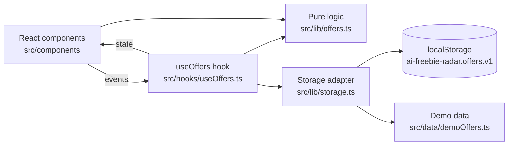

# Design Document

## Overview

AI Freebie Radar is a single-page React + TypeScript app built with Vite. All business rules (status, filtering, sorting, validation, storage parsing) live in framework-free pure functions under `src/lib/`. React components under `src/components/` only render state and forward events. State is held in one `useOffers` hook that syncs to localStorage. There is no backend.

## Architecture



### File layout

```
src/
  types.ts                 # Offer, Category, OfferStatus, OfferFilter
  lib/offers.ts            # getOfferStatus, filterOffers, sortOffersByDeadline, validateOffer, toDateKey
  lib/storage.ts           # loadOffers, saveOffers, parseStoredOffers
  data/demoOffers.ts       # DEMO_OFFERS
  hooks/useOffers.ts       # list state + CRUD + persistence
  components/
    FilterBar.tsx          # category / status / sort controls
    OfferForm.tsx          # create + edit form with inline validation
    OfferList.tsx          # list of OfferCard
    OfferCard.tsx          # one offer with status badge and actions
  App.tsx
  main.tsx
  index.css
```

## Components and Interfaces

### Pure functions (`src/lib/offers.ts`)

```ts
toDateKey(date: Date): string                         // local YYYY-MM-DD
isValidDateKey(value: string): boolean
getOfferStatus(offer: Pick<Offer, 'deadline'>, today: Date): OfferStatus
filterOffers(offers: readonly Offer[], filter: OfferFilter, today: Date): Offer[]
sortOffersByDeadline(offers: readonly Offer[], direction?: 'asc' | 'desc'): Offer[]
validateOffer(draft: OfferDraft): Partial<Record<keyof OfferDraft, string>>
```

- `today` is always injected so functions are deterministic and testable.
- Dates are compared as `YYYY-MM-DD` strings, which sort lexicographically in date order and avoid time-zone drift.
- No function mutates its input.

### Storage (`src/lib/storage.ts`)

- `parseStoredOffers(raw: string | null): Offer[] | null` returns `null` for missing/invalid data and drops malformed records.
- `loadOffers(storage)` falls back to `DEMO_OFFERS` when parsing returns `null`.
- `saveOffers(storage, offers)` writes JSON; errors (quota, private mode) are caught and ignored.

### UI

- `App` owns filter + sort state, calls `filterOffers` then `sortOffersByDeadline`, passes the result to `OfferList`.
- `OfferForm` is used for both create and edit; it shows validation messages from `validateOffer` next to fields.
- Delete and reset use `window.confirm`.

## Data Models

```ts
type Category = 'api-credits' | 'free-trial' | 'early-access' | 'student-dev' | 'model-event' | 'tool-discount';
type OfferStatus = 'active' | 'expired';

interface Offer {
  id: string;
  title: string;
  provider: string;
  category: Category;
  value: string;        // e.g. "$300 credits"
  deadline: string;     // 'YYYY-MM-DD' or ''
  requirements: string;
  region: string;       // e.g. "Global", "US only"
  url: string;
  notes: string;
}

type OfferDraft = Omit<Offer, 'id'>;

interface OfferFilter {
  category: Category | 'all';
  status: OfferStatus | 'all';
}
```

## Correctness Properties

*A property is a characteristic or behavior that should hold true across all valid executions of a system — essentially, a formal statement about what the system should do.*

### Property 1: Past deadlines are expired

*For any* date `today` and any valid deadline strictly earlier than `toDateKey(today)`, `getOfferStatus` returns `expired`.

**Validates: Requirements 1.1**

### Property 2: Today, future, empty or invalid deadlines are active

*For any* `today` and any deadline that is `>= toDateKey(today)`, empty, or an arbitrary non-date string, `getOfferStatus` returns `active` and never throws.

**Validates: Requirements 1.2, 1.3, 1.4**

### Property 3: Category filter soundness and completeness

*For any* list of offers and any category `c`, every offer in `filterOffers(offers, {category: c, status: 'all'}, today)` has `category === c`, and every input offer with `category === c` is present in the output.

**Validates: Requirements 2.1, 2.2**

### Property 4: Status filter and subset/order preservation

*For any* list of offers and any filter, every output offer satisfies the filter, the output is a subsequence of the input (same relative order), and `{all, all}` returns the full input. An empty input returns `[]`.

**Validates: Requirements 2.3, 2.4, 2.5, 2.6**

### Property 5: Deadline sort is monotonic

*For any* list of offers, the valid deadlines in `sortOffersByDeadline(offers, 'asc')` are non-decreasing (non-increasing for `'desc'`), and all offers with empty/invalid deadlines come after all offers with valid deadlines.

**Validates: Requirements 3.1, 3.2, 3.3**

### Property 6: Sort is a non-mutating permutation

*For any* list of offers, the sorted result has the same length and the same multiset of `id`s as the input, the input array is unchanged, and an empty input returns `[]`.

**Validates: Requirements 3.4, 3.5**

### Property 7: Storage round trip

*For any* list of valid offers, `parseStoredOffers(JSON.stringify(offers))` deep-equals `offers`; for any non-JSON string it returns `null` without throwing.

**Validates: Requirements 5.1, 5.3, 5.4**

## Error Handling

| Situation | Behavior |
|---|---|
| Invalid/missing localStorage data | Load demo data, no crash |
| localStorage write fails | Swallow error, app keeps working in memory |
| Invalid deadline string | Treated as no deadline (active, sorted last) |
| Form validation errors | Inline messages, save blocked |

## Testing Strategy

- **Unit tests** (Vitest): concrete examples for status, filter, sort, validation and storage in `src/lib/*.test.ts`.
- **Property-based tests** (Vitest + fast-check): Properties 1–7 in `src/lib/offers.property.test.ts`, generated and run through the Kiro IDE spec task flow, at least 100 runs per property. Each test is tagged with `Feature: ai-freebie-radar, Property N`.
- **Typecheck**: `tsc -b` in strict mode, also run by the save hook.
