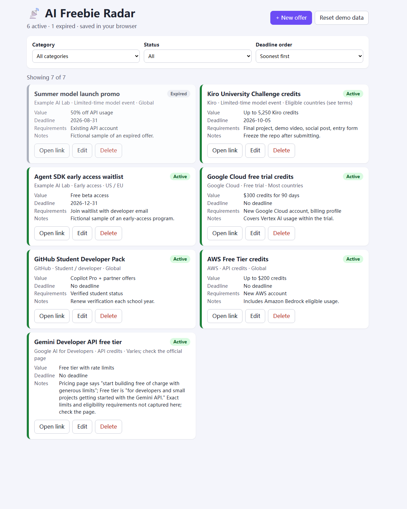

# 📡 AI Freebie Radar

A lightweight web app for tracking AI perks: free API credits, free trials, early access, student/developer benefits, limited-time model events and AI tool discounts. Create, edit, delete, filter by category or status, and sort by deadline. Status (Active/Expired) is computed from the deadline, and everything is saved in your browser's localStorage. No backend, no login, no API keys.

Built with Kiro for the **Kiro University Challenge 2026** Final.



Mobile: [`docs/screenshots/app-mobile.png`](docs/screenshots/app-mobile.png)

## Run it

Requires Node.js 20+.

```bash
npm install
npm run dev        # http://localhost:5173
npm run check      # typecheck + unit tests + property-based tests
npm run build      # production build to dist/
```

## Features

- Add, edit and delete offers (title, provider, category, value, deadline, requirements, region, url, notes)
- Filter by category and by Active / Expired
- Status computed automatically: a deadline before today means Expired; an empty deadline means Active
- Sort by deadline (soonest or latest first; undated offers last)
- Persists to localStorage (`ai-freebie-radar.offers.v1`); "Reset demo data" restores the sample offers
- Mobile-friendly single-column layout, labelled inputs, text status badges

## Project layout

```
src/lib/offers.ts        pure logic: getOfferStatus, filterOffers, sortOffersByDeadline, validateOffer
src/lib/storage.ts       localStorage load/save with safe fallback
src/lib/*.test.ts        unit tests + property-based tests (fast-check)
src/data/demoOffers.ts   built-in demo data
src/hooks/useOffers.ts   state + persistence
src/components/          FilterBar, OfferForm, OfferList, OfferCard
```

## Kiro University Challenge

Checklist with official requirements and status: [`CHALLENGE_CHECKLIST.md`](CHALLENGE_CHECKLIST.md). Lesson numbering follows the official page (https://kiro.dev/2026/university/).

### Lesson 1: Spec-driven development
A Kiro Feature Spec (requirements-first) with EARS requirements, e.g. *WHEN an Offer's Deadline is earlier than Today, THE System SHALL classify the Offer as `expired`*. The design defines 7 correctness properties, and the app was built by executing the task list.
Files: `.kiro/specs/ai-freebie-radar/requirements.md`, `design.md`, `tasks.md`

### Lesson 2: Steering documents
`project-standards.md` (always included) enforces strict TypeScript, pure functions in `src/lib/`, small components, no extra dependencies or backend, a mobile/accessible UI and demo-first scope, with good/bad code examples. `offer-data.md` (fileMatch on `src/types.ts` and `src/data/**`) enforces complete, honest offer records.
Files: `.kiro/steering/project-standards.md`, `.kiro/steering/offer-data.md`

### Lesson 3: Hooks
A `PostFileSave` hook on `src/**/*.ts(x)` runs `scripts/hook-check.mjs`, which runs `tsc --noEmit` + `vitest --run` and appends the result to a log. It fired on real agent saves during development.
Files: `.kiro/hooks/typecheck-on-save.json`, `scripts/hook-check.mjs`, `docs/evidence/hook-run.log`

### Lesson 4: Property-based testing (Kiro IDE)
Kiro extracted Properties 1–7 from the spec (design.md) and generated fast-check tests through the spec task flow (tasks 7.1–7.7), 100 runs each. They cover: past deadlines are expired; today/future/empty/invalid deadlines are active; the category filter returns only (and all) matching offers; filter results are an ordered subset; the deadline sort is monotonic; the sort is a non-mutating permutation; the storage round trip is lossless and never crashes on bad JSON.
Files: `src/lib/offers.property.test.ts`, `src/lib/storage.property.test.ts`, `.kiro/specs/ai-freebie-radar/tasks.md` (task 7)

### Lesson 5: Powers
A project power `ai-freebie` in the Agent Plugins format: `plugin.json` with keywords (`freebie`, `ai credits`, `trial`, `early access`, `羊毛`, …) and an `add-offer` skill that walks Kiro through adding and validating one offer.
Files: `powers/ai-freebie/plugin.json`, `powers/ai-freebie/skills/add-offer/SKILL.md`
Use: Kiro → Powers panel → Add Custom Power → Import power from a folder → `powers/ai-freebie`, then say "add a new AI freebie".

### Lesson 6: MCP
A workspace `fetch` MCP server (`uvx mcp-server-fetch`, free, no key) reads public offer pages so Kiro can fill in a record from the source. It read the Gemini API pricing page used for the `demo-gemini-api-free-tier` record. `scripts/mcp-fetch-smoke.mjs` performs a full MCP handshake and a `fetch` call.
Files: `.kiro/settings/mcp.json` (template: `docs/mcp/mcp.json`), `docs/evidence/mcp-fetch.md`

### Lesson 7: Custom agents
`freebie-curator` is limited to read/write tools plus the fetch MCP server. It can write only to `src/data/**` and `docs/evidence/**`, is pre-approved only for `npm run check`/`npm test`, and is denied destructive commands. It is preloaded with the spec, steering, `src/types.ts`, the demo data and the `add-offer` skill. It added the Gemini free tier record and verified it.
Files: `.kiro/agents/freebie-curator.json`, `docs/evidence/custom-agent-run.md`

### Bonus
- **Bonus 2 (Package a Kiro power):** `powers/ai-freebie/` is a complete, shareable power (manifest + skill), importable from a folder or from this GitHub repo.
- **Bonus 1 (Kiro Web / cloud sessions):** paid plans only; not attempted.

## Notes

Demo data values are illustrative and change often. Always check the official page. The two "Example AI Lab" entries are fictional samples used to show the expired and early-access states.
